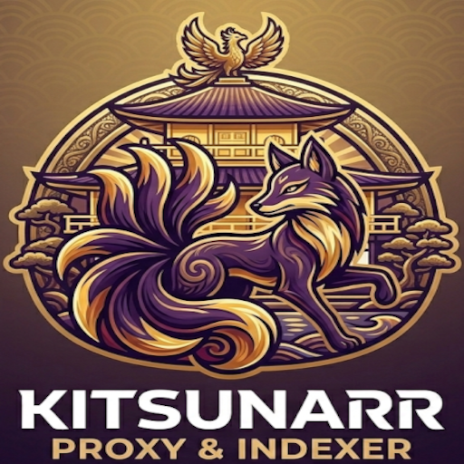

<p align="center">
  
</p>

<h1 align="center">Kitsunarr</h1>

<p align="center">
  <strong>Proxy Inteligente & Indexador</strong><br>
  El puente entre trackers de nicho y la automatización inteligente.
</p>

---

### 🦊 ¿Qué es Kitsunarr?

**Kitsunarr** es un proxy e indexador especializado diseñado para escenarios donde herramientas generalistas como Prowlarr no logran una integración perfecta con trackers de anime complejos. Actúa como un **reformateador activo** que traduce el contenido de trackers de nicho al estándar **Torznab** que Sonarr entiende a la perfección.

Se centra exclusivamente en el ecosistema del anime, proporcionando una capa de inteligencia que normaliza nombres, extrae metadatos técnicos y asegura que tu biblioteca esté siempre bien organizada.

---

### ✨ Características Principales

* **🚀 Proxy e Indexador Torznab**: Habilita la compatibilidad de trackers privados de nicho con Sonarr.
* **🔍 Scraping Avanzado**: Raspado automático de fichas técnicas para extraer metadatos completos (códecs, subtítulos, resoluciones y sinopsis) y generar resultados preparados para Sonarr.
* **⚡ Caché Inteligente**: Base de datos local que almacena resultados para realizar menos peticiones a los trackers, optimizando el rendimiento y protegiendo tu cuenta.
* **🧪 Búsqueda Interactiva**: Interfaz dedicada para realizar búsquedas manuales con vista previa detallada de las fichas almacenadas.
* **📟 Consola de Eventos**: Terminal interna para monitorizar logs y procesos del sistema en tiempo real.
* **🎨 UI Moderna y Amigable**: Interfaz oscura (Cyberpunk-inspired) diseñada para facilitar la navegación y gestión de datos.

---

### 🧠 Inteligencia Artificial y Precisión

#### Integración con LLMs
Kitsunarr se integra con servicios de **IA locales (Ollama)** o en la **nube (Google Gemini, OpenAI)** para elevar la precisión de los metadatos. Esta capa de inteligencia se encarga de:
* Refinar la generación de fichas de contenido.
* Estructurar nombres de episodios y temporadas de forma coherente.
* Mejorar el acierto de "hits" en Sonarr mediante la normalización de títulos complejos.

#### Validación con TheTVDB
Utiliza **TheTVDB** como fuente de contraste externa para validar IDs de series y temporadas, asegurando que cada archivo en la caché esté correctamente vinculado a los estándares de la industria.

---

### 📦 Instalación con Docker

La forma recomendada de ejecutar Kitsunarr es mediante docker.

#### 1. Preparar el archivo `.env`
Copia el contenido de `.env.example` a un nuevo archivo llamado `.env` y ajusta tus valores:

```env
# Puerto en el que accederás desde tu navegador
KITSUNARR_PORT=4080

# Ruta donde se guardará la base de datos
KITSUNARR_CONFIG=./data

# Zona horaria
TZ=Europe/Madrid
```

#### 2. Preparar el archivo `docker-compose.yml`
```yaml
services:
  kitsunarr:
    image: ghcr.io/kaizy48/kitsunarr:latest
    container_name: kitsunarr
    restart: unless-stopped
    env_file:
      - .env
    ports:
      - "${KITSUNARR_PORT}:4080"
    environment:
      - KITSUNARR_DATA_DIR=/app/data
      - TZ=${TZ}
    volumes:
      - ${KITSUNARR_CONFIG}:/app/data
```


### ⚖️ Licencia y Transparencia

Este proyecto es de **Código Abierto** bajo la licencia **GNU GPL v3**. Creemos en la transparencia total: el código es auditable para que cualquier usuario sepa exactamente cómo se manejan sus sesiones y datos.

**Desarrollo Asistido por IA**: Este software utiliza herramientas de Inteligencia Artificial en su proceso de creación para optimizar la lógica y el flujo de trabajo. No obstante, **todo el código es revisado, editado y validado manualmente por programadores con conocimientos técnicos** para garantizar que el sistema sea seguro, eficiente y cumpla con los estándares de calidad necesarios para su uso en producción.

**Nota sobre Atribución**: Tienes derecho a ver, modificar y usar este código. Sin embargo, para cualquier clon o proyecto derivado, **se exige la mención expresa de Kitsunarr como el proyecto original**, manteniendo los créditos del autor de forma visible y clara en todo momento.

#####################

⚠️ Disclaimer (Aviso Legal)
Kitsunarr es una herramienta de software diseñada exclusivamente como un proxy de metadatos y organizador de información para uso personal.

No comparte archivos: Kitsunarr no aloja, distribuye ni facilita la descarga de archivos protegidos por derechos de autor.

No es un cliente de descarga: La aplicación no descarga contenido; su única función es facilitar la comunicación de datos entre servicios de terceros.

Responsabilidad: El usuario es el único responsable del uso que haga de esta herramienta, de las credenciales de trackers que configure y de asegurar que su actividad cumple con las leyes locales y los términos de servicio de terceros.

Independencia: Kitsunarr no tiene afiliación oficial con Sonarr o Prowlarr.

#####################
Desarrollado para hacer el self-hosting de anime más inteligente y sencillo. 🦊✨